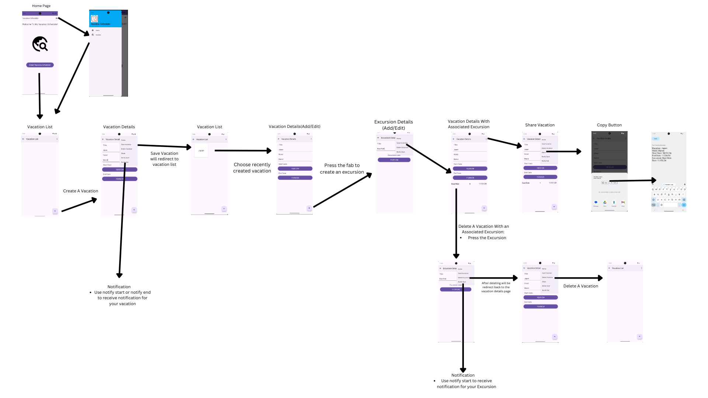

# Mobile Application Development(Android) D308
#### Creator: Jordan Nitta-Rodrigues

## Title and Purpose

#### Title: My Vacation Scheduler

#### Purpose: My VacationScheduler is a mobile application designed to help people manage their vacation and any excursion activity associated with their vacations. The application allows users to create, read, update and delete (CRUD) functionality both for the vacation details and excursion details page. Using my application it will allow users to plan their vacation, and activitys, and be able to set notification for when their vacation is starting and also ending. It will also have excursion notification you can set for when your excursion begins.

##  Directions for how to operate the application

- Home Screen:
  - The application has two ways for you to get into the Vacation List Screen:=
  - The first way is by clicking on the menu icon and selecting "Vacations."
  - The second way is by pressing the "Enter Application." button located at the bottom of the screen
- Vacation List Screen:
  - This screen will be a display of all vacations created by the user
  - To create a new vacation press the “Fab Button” located in the bottom right corner of the screen
  - After creating a vacation it will display on this screen
  - **Click on an existing vacation from the list of vacation to view the detailed information on the vacation details page, where all data for that vacation is displayed**
  - To navigate back to the "Home Page," use the back arrow or the menu in the top right corner and click "Home."
- Vacation Details and (Associated Excursion) Screen:
  - Use the menu in the top right corner to save, delete, and notify the start and end of a vacation.
  - This screen allows you to create, update, edit, and delete a vacation. Good news you can create as much vacation as you want
  - Fill out all the necessary info in the form to create a vacation.
  - **Saving/(creating) a vacation, will redirect you back to the Vacation List Screen, where you can select the recently created vacation to view and edit it details. If you want to add an excursion to this vacation press the "Fab Button" located in the bottom right corner.**
  - To delete a vacation, press delete located in the menu
  - To share a vacation select the share button located in the menu and when it appears use the clipboard icon to copy the text
  - **To receive a notification, you will press “Notify Start” or “Notify End”, from the menu. Make sure you enable notification on the Emulator so the notification shows up.**
  - Note that you cannot delete a vacation if there is an excursion associated with the vacation. A validation message will display, telling the user an associated excursion is attached to the vacation.
  - Note that there will be a validation message if the title and hotel field are saved with no data. The title and hotel need to contain content before saving a vacation.
  - Note that you cannot create a vacation if the end date is before the start date. A validation message will display.
- Excursion Details Screen:
  - To access this screen, choose a vacation from the Vacation List Screen and press the “Fab Button” on the Vacation Details Page
  - This screen will allow you to create, update, delete, and receive notification for the excursion start
  - To create an excursion, fill out all the form fields and press save using the menu. When the excursion saves, it will redirect you to the vacation details screen, where the excursion will be display with the vacation it belongs to.
  - To update an excursion, select the excursion you want to update from the vacation details page. Once selected, you will be redirected to the excursion details page with the populated data you created for that excursion. Edit the info and press save if you are happy with the changes.
  - To delete an excursion, select the excursion from the vacation details page. Once selected, you will be redirected to the excursion details page with the populated data for the excursion. Press delete from the menu, and it will route you back to the vacation details page, and your excursion will be deleted.
  - To alert a notification, navigate to the excursion and press “Notify Start” located in the menu.
  - Note that there will be a validation message if the title field is saved with no data. The title needs to contain content before saving an excursion.
  - Note that you can only save an excursion if the date is during the vacation. You will get a validation message describing what you need to do before you can save the excursion.

## Android version the signed APK is deployed
The signed APK is deployed to Android 13.0("Tiramisu") API 33

## Git Repository
[Jordan Repository](https://https://gitlab.com/wgu-gitlab-environment/student-repos/jnittar/d308-mobile-application-development-android/-/tree/working_branch?ref_type=heads)

##  Storyboard to demonstrate application flow 

